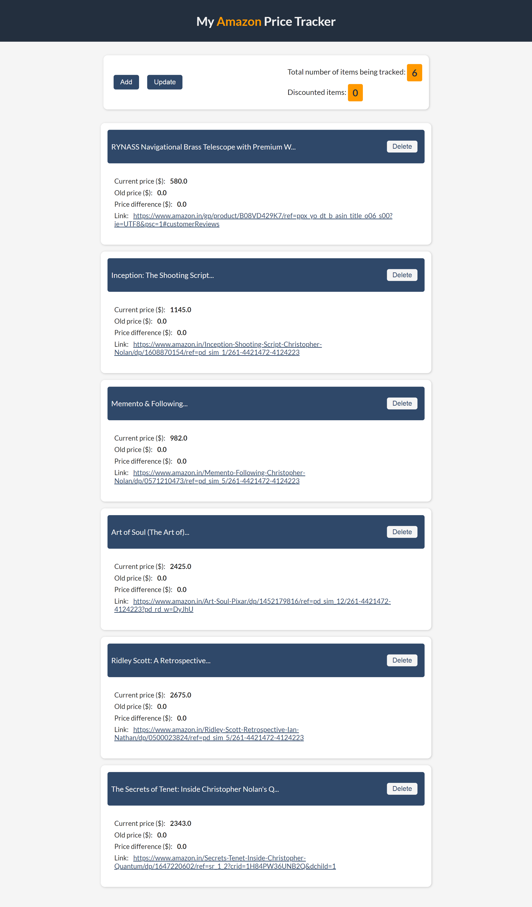

# Amazon Price Tracker

- A simple web app where users can add their personal preferences of amazon items to their list which, they want to keep track of prices.
- The update option of this project will make sure to send an email to the users for the list of items that are at a low price.

# Installation

- 1 - clone repo https://github.com/Vasudevatirupathinaidu/Amazon-Price-Tracker
- 2 - create a virtual environment and activate
- - python -m venv env
- - env\Scripts\activate
- 3 - cd into project "cd Amazon-Price-Tracker"
- 4 - pip install -r requirements.txt
- 5 - python manage.py runserver

# Tech Stack

- Javascript
- Django
- HTML5/CSS3

# Home Page

